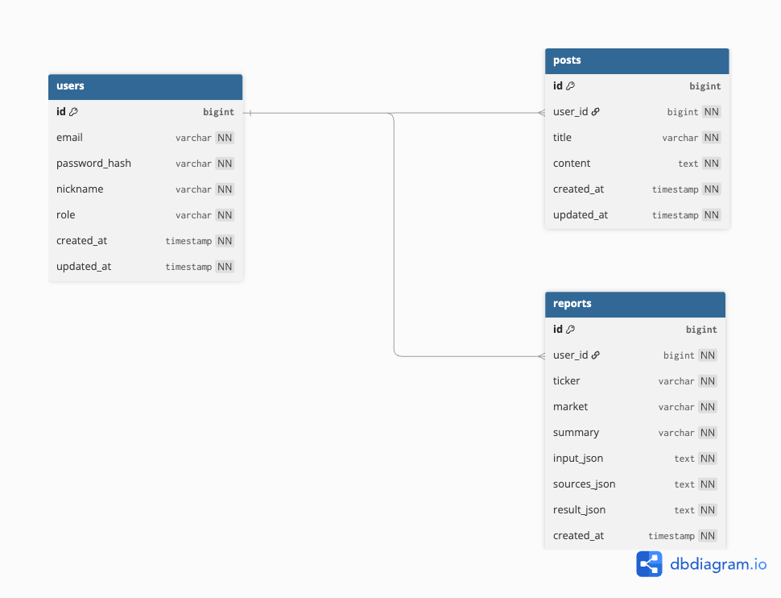

# 📈 Stock Insight API

**Stock Insight API**는 사용자가 선택한 주식 정보를 기반으로  
**GPT API를 활용해 자동 분석 리포트를 생성·관리하는 Spring Boot 백엔드 서비스**입니다.

JWT 기반 인증을 통해 사용자별 레포트 소유권을 관리하며,  
실무 환경을 고려한 **Stateless API 구조 + AI 연동 백엔드 설계**를 목표로 개발되었습니다.

---

## 🛠 Tech Stack

- **Java 17**
- **Spring Boot**
    - Spring Web
    - Spring Data JPA
    - Spring Security
- **GPT API (OpenAI)**
- **JWT (jjwt)**
- **JPA / Hibernate**
- **Gradle**
- **Database**
    - MySQL / PostgreSQL / H2 (환경별 선택)

---

## 🧩 Architecture Overview

- RESTful API 기반 백엔드
- JWT 기반 Stateless 인증 구조
- GPT API 연동을 통한 AI 분석 레포트 생성
- Layered Architecture
    - Controller
    - Service
    - Domain(Entity / Repository)
- 사용자(User) 중심 도메인 설계
- 기능 단위 Feature Branch + PR 기반 Git Workflow

---

## 🔐 Authentication & Security

- 회원가입 / 로그인 기능 제공
- 로그인 성공 시 **JWT Access Token 발급**
- 이후 모든 인증 필요 요청은  
  `Authorization: Bearer <token>` 헤더를 통해 인증
- 비밀번호는 **BCrypt 해시**로 저장
- Spring Security Filter 기반 인증 처리
- 서버는 로그인 상태를 저장하지 않는 **Stateless 구조**

---

## 🤖 GPT 기반 주식 레포트 생성

- GPT API를 활용하여 주식 관련 데이터를 분석
- 정형 데이터 + 프롬프트 기반 분석 결과 생성
- 사용자 요청에 따라 **자동으로 주식 분석 리포트 생성**
- 생성된 리포트는 DB에 저장되어 사용자별로 관리

---

## ✨ Core Features

### 1️⃣ User Management
- 회원가입
- 로그인 (JWT 발급)
- 인증된 사용자 정보 조회
- 사용자 권한(Role) 기반 구조 설계

### 2️⃣ Stock Report Management
- 주식 분석 리포트 생성 (GPT API 연동)
- 사용자별 레포트 소유권 관리
- 로그인한 사용자 기준 레포트 조회
- 레포트 데이터 영속화 및 관리

### 3️⃣ API Security
- 인증/비인증 API 분리
- JWT 기반 인증 처리
- 확장 가능한 권한 관리 구조

---

## 📂 Project Structure (Simplified)

```
src/main/java
├── api
│ ├── auth # 회원가입 / 로그인 API
│ ├── user # 사용자 관련 API
│ └── report # 주식 리포트 API (GPT 연동)
├── domain
│ ├── user # User Entity / Repository
│ └── report # Report Entity / Repository
├── security # JWT / 인증 필터
├── gpt # GPT API 연동 로직
└── config # Security / Bean 설정
```

---

## 🚀 API Examples

### 회원가입
```http
POST /auth/signup
Content-Type: application/json

{
  "email": "test@example.com",
  "password": "password1234",
  "nickname": "yujun"
}

```
### 로그인
```
POST /auth/login
Content-Type: application/json

{
  "email": "test@example.com",
  "password": "password1234"
}
```
### 인증된 사용자 정보 조회
```
GET /users/me
Authorization: Bearer <JWT_TOKEN>

```
### 주식 레포트 생성
```
POST /reports
Authorization: Bearer <JWT_TOKEN>
Content-Type: application/json

{
  "stockCode": "AAPL",
  "analysisPeriod": "1Y"
}
```
---
## 🧪 Local Setup
```
git clone https://github.com/your-repo/stock-insight-api.git
cd stock-insight-api
./gradlew bootRun
```
OpenAI API Key는 반드시 환경변수 또는 별도 설정 파일로 관리해야 합니다.

**openai.api-key=~~~**

## 🗂 ERD (Entity Relationship Diagram)

아래 ERD는 사용자 인증과 주식 리포트 소유권을 중심으로 한  
Stock Insight API의 핵심 도메인 구조를 나타냅니다.




